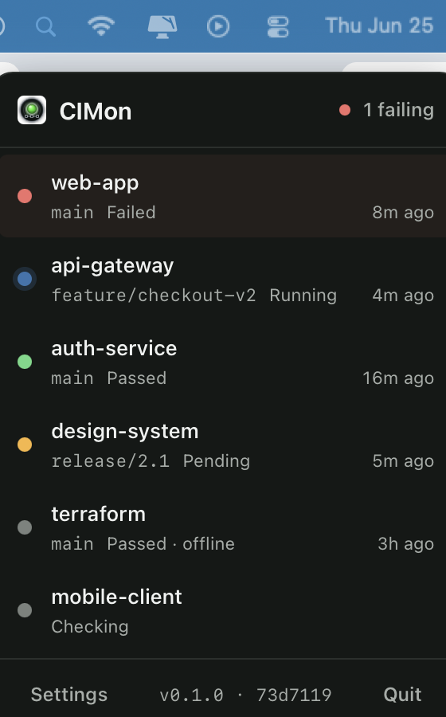
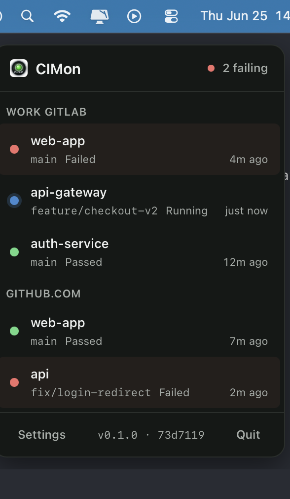
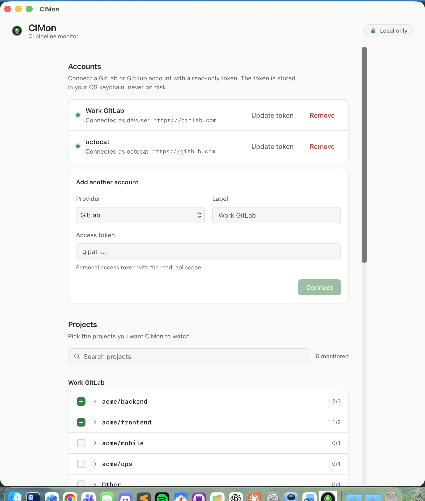
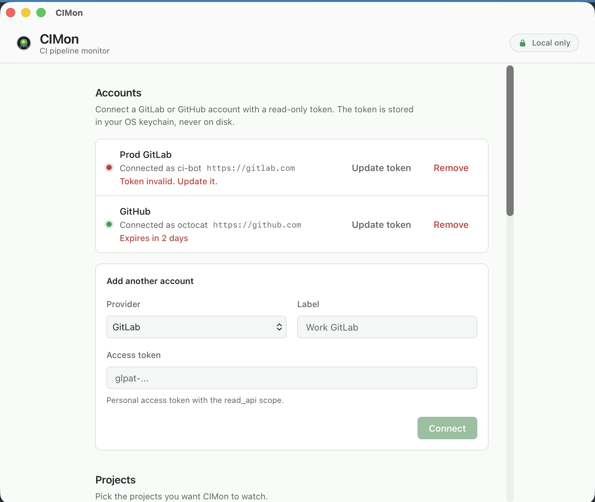

# CIMon

CIMon (think "Simon", for CI Monitoring) is a small, cross-platform desktop app that lives in your system tray on Windows or your menu bar on macOS and tells you what your CI pipelines are doing. It watches your CI and surfaces pipeline progress as native notifications, so you can stop babysitting browser tabs.

> Status: early development. CIMon monitors GitLab and GitHub pipelines, including self-managed GitLab and GitHub Enterprise instances, on macOS, Windows, and Linux. Builds are not yet code-signed (see [Download and install](#download-and-install)).

## Screenshots

<table>
  <tr>
    <td align="center" width="50%" valign="top">
      <br>
      <sub>The menu bar popover shows live status for every project you monitor.</sub>
    </td>
    <td align="center" width="50%" valign="top">
      <br>
      <sub>Projects are grouped by account once you connect more than one.</sub>
    </td>
  </tr>
  <tr>
    <td align="center" width="50%" valign="top">
      <br>
      <sub>Connect accounts and pick which projects to watch.</sub>
    </td>
    <td align="center" width="50%" valign="top">
      <br>
      <sub>Token health is surfaced in Settings: a revoked token and one expiring soon.</sub>
    </td>
  </tr>
</table>

> The screenshots use built-in demo data, not real repositories. See [Demo data for screenshots](#demo-data-for-screenshots).

## Why CIMon

* It lives where you can glance at it. A true menu bar item on macOS and a real tray icon on Windows, with the icon reflecting the worst current status across the projects you monitor.
* It is quiet by default and configurable. Choose which events you care about (started, succeeded, failed), at the pipeline level, the job level, or both, and get a native notification only for those.
* It is fast and light. Built on Tauri v2 (a Rust core with a small web UI), so it uses very little memory while running all day.

## Privacy

CIMon is fully standalone. It runs entirely on your machine and talks directly to the CI provider you configure. There is no CIMon cloud service, no CIMon account, and no telemetry. Your access token is stored in the operating system credential store (macOS Keychain, Windows Credential Manager, and on Linux the Secret Service API provided by GNOME Keyring or KDE Wallet), never in a plain file, and it is never sent anywhere except the GitLab or GitHub instance you point it at.

## Features

* Connect one or more GitLab and GitHub accounts, each with a scoped, read-only access token. An account can point at gitlab.com, a self-managed GitLab instance, github.com, or a GitHub Enterprise instance.
* Auto-discover the projects your token can access (GitLab projects or GitHub repositories) and pick which ones to monitor.
* Background polling with native notifications when a monitored pipeline (a GitLab pipeline or a GitHub Actions workflow run), or an individual job within it, starts, succeeds, or fails. Pipeline-level and job-level notifications are independent toggles. Click a notification to open the relevant page in your browser (the specific job for a job notification, the pipeline otherwise).
* Tray / menu bar icon showing the aggregate status across the projects you monitor, with quick links to open a pipeline in your browser.
* Token health monitoring. If a token becomes invalid, revoked, or expired, the affected account is flagged distinctly in the popover and in Settings (not as a generic connection error), with a one-time notification, and you can replace the token in place from Settings without removing the account. CIMon also warns before a token expires (on launch, then at 72 hours and 24 hours remaining) and shows an "expires in N days" indicator next to each account.
* Light, dark, or system appearance, with the interface available in English and French.
* Launch at login.

CIMon is read-only. It monitors and notifies. It does not trigger, re-run, or cancel pipelines.

## Download and install

Pre-built installers for macOS, Windows, and Linux are published on the [Releases](https://github.com/Fuitad/cimon/releases) page. Download the file for your platform and install it the usual way.

These early builds are not yet code-signed, so each operating system shows a warning the first time you open the app. That is expected for an unsigned app in early development. Here is how to get past it.

### macOS

macOS Gatekeeper blocks unsigned apps downloaded from the internet. After moving CIMon into your Applications folder:

1. Right-click (or Control-click) CIMon and choose Open.
2. In the dialog that appears, click Open again.

You only need to do this once. CIMon opens normally afterward. If you prefer the terminal, clear the quarantine flag instead:

```sh
xattr -dr com.apple.quarantine /Applications/CIMon.app
```

### Windows

Windows SmartScreen may show a "Windows protected your PC" dialog for the unsigned installer. Click More info, then Run anyway to continue.

### Linux

The `.deb`, `.rpm`, and `.AppImage` builds need no signing. Install the package for your distribution, or make the AppImage executable and run it:

```sh
chmod +x CIMon_*.AppImage
./CIMon_*.AppImage
```

CIMon stores your access tokens through the Secret Service API, so a provider such as GNOME Keyring or KWallet must be installed and running. Most desktop environments (GNOME, KDE) include one by default. On a minimal or headless setup without one, CIMon warns at startup and cannot save or read tokens until a provider is available.

## Requirements (development)

* Node.js 20.19 or newer (Vite 8 requires 20.19+, or 22.12+) and npm
* Rust (stable) and Cargo
* Platform build tools for Tauri (see the [Tauri prerequisites](https://v2.tauri.app/start/prerequisites/))

## Development

```sh
npm install
npm run tauri dev
```

Build a release bundle:

```sh
npm run tauri build
```

On macOS, `npm run build:mac` instead builds the bundle, installs it into `/Applications`, and code-signs it with a local identity so notification banners appear (an ad-hoc signed build shows notifications only in Notification Center). See [Contributing](CONTRIBUTING.md) for the one-time certificate setup.

Run the frontend tests (Vitest):

```sh
npm test          # watch mode
npm run test:run  # one-shot, the way CI runs them
```

Run the Rust unit tests:

```sh
cd src-tauri && cargo test
```

### Demo data for screenshots

The screenshots in this README come from a built-in fixtures mode that fills the app with fabricated projects, so no real repository is ever shown. It runs only in a development build (it is compiled out of release builds) and is driven by environment variables:

```sh
# Menu bar popover with a spread of statuses, dark theme
CIMON_FIXTURES=panel CIMON_FIXTURES_THEME=dark npm run tauri dev

# Settings window with two accounts, light theme
CIMON_FIXTURES=multi CIMON_FIXTURES_SURFACE=settings CIMON_FIXTURES_THEME=light npm run tauri dev
```

`CIMON_FIXTURES` selects the dataset (`panel`, `multi`, or `tokenhealth`). `CIMON_FIXTURES_SURFACE` selects what to show (`panel` for the menu bar popover, `settings` for the settings window). `CIMON_FIXTURES_THEME` forces the appearance (`light`, `dark`, or `system`). In this mode CIMon skips the live poller and reads no accounts or tokens, so it never touches your real configuration.

### Code quality

Run the full quality gate (lint, format, static analysis, dead-code, types, tests) the way CI does:

```sh
npm run check
cd src-tauri && cargo fmt --check && cargo clippy --all-targets -- -D warnings && cargo machete && cargo test
```

`npm install` installs a pre-commit hook that runs this gate automatically before each commit. See [CONTRIBUTING](CONTRIBUTING.md) for the coding standards and the test-driven development workflow.

## Access token scopes

CIMon only reads project and pipeline data, so a read-only token is enough. The same scopes apply whether the account is the hosted service or a self-managed / Enterprise instance.

* GitLab: a personal access token (or project access token) with the `read_api` scope.
* GitHub: a classic personal access token with the `repo` scope, or a fine-grained token with read-only access to Actions, Contents, and Metadata.

## License

MIT. See [LICENSE](LICENSE).
